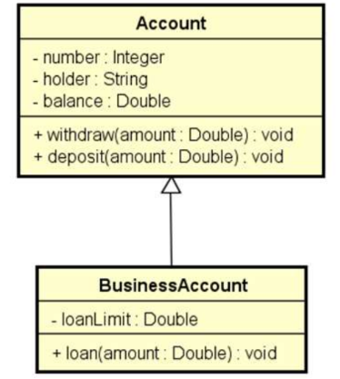

# 🎓 Herança

- É um tipo de associação que permite que uma classe herde dados e comportamento de outra

- Definições importantes:

  - Relação "é-um"
  - Generalização/especialização
  - Superclasse (classe base) / subclasse (classe derivada)
  - Herança / extensão
  - Herança é uma associação entre classes (e não entre objetos)

- Vantagens:

  - Reuso
  - Polimorfismo

- Sintaxe:
  - : (estende)
  - base (referência para a superclasse)

## 📋 Exemplo

Suponha um negócio de banco que possui uma conta comum e uma conta para
empresas, sendo que a conta para empresa possui todos membros da conta
comum, mais um limite de empréstimo e uma operação de realizar empréstimo.

## 🛠️ Estrutura

### Diagrama de Classes

