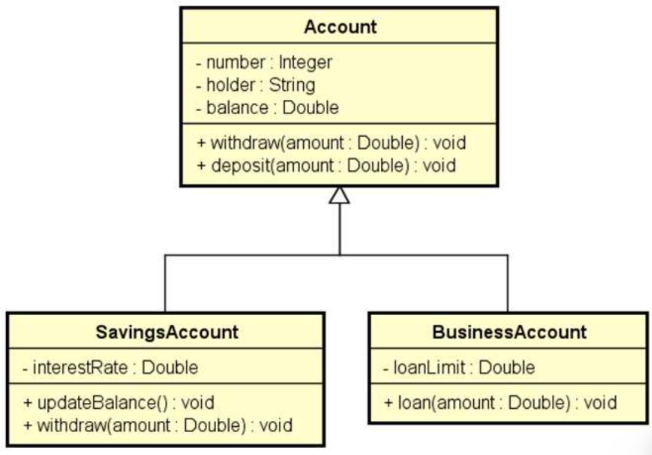

# 🎓 Sobreposição, Palavras Virtual, Override e Base

## Sobreposição ou Sobreescrita

- É a implementação de um método de uma superclasse na subclasse

- Para que um método comum (não abstrato) possa ser sobreposto, deve ser incluído nele o prefixo **"virtual"**

- Ao sobrescrever um método, devemos incluir nele o prefixo **"override"**

### 📋 Exemplo 1

Suponha as seguintes regras para saque:

- Conta comum: é cobrada uma taxa no valor de 5.00.
- Conta poupança: não é cobrada taxa.
  Como resolver isso?

Resposta: sobrescrevendo o método withdraw na subclasse SavingsAccount

## 🛠️ Estrutura

### Diagrama de Classes



## Palavra base

- É possível chamar a implementação da superclasse usando a palavra base.

- Exemplo: suponha que a regra para saque para conta poupança seja realizar o saque normalmente da superclasse (Account), e depois descontar mais 2.0.

```c#
public override void Withdraw(double amount)
{
    base.Withdraw(amount);
    Balance -= 2.0;
}

```
