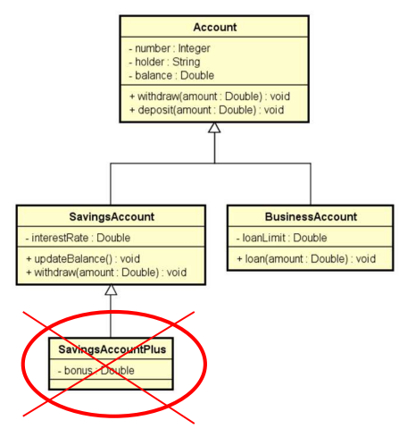

# 🎓 Classes e métodos selados

## Sobreposição ou Sobreescrita

- Palavra chave: sealed

- **Classe**: evita que a classe seja herdada

  - Nota: ainda é possível extender a funcionalidade de uma classe selada usando "extension methods"

- **Método**: evita que um método sobreposto possa ser sobreposto novamente
  - Nota: Só pode ser aplicado a métodos sobrepostos

### 📋 Exemplo: Classe selada

Suponha que você queira evitar que sejam criadas subclasses de SavingsAccount

## 🛠️ Estrutura

### Diagrama de Classes



```c#
namespace Course
{
    sealed class SavingsAccount
    {
      ...
    }
}

```

### 📋 Exemplo: Método selado

Suponha que você não queira que o método Withdraw de SavingsAccount seja sobreposto novamente

```c#

namespace Course
{
    class SavingsAccount
    {
        ...

        public sealed override void Withdraw(double amount)
        {
            base.Withdraw(amount);
            Balance -= 2.0;
        }
    }
}

```

## Pra quê?

- Segurança: dependendo das regras do negócio, às vezes é desejável garantir que uma classe não seja herdada, ou que um método não seja sobreposto.

  - Geralmente convém selar métodos sobrepostos, pois sobreposições múltiplas podem ser uma porta de entrada para inconsistências

- Performance: atributos de tipo de uma classe selada são analisados de forma mais rápida em tempo de execução.
  - Exemplo clássico: string
